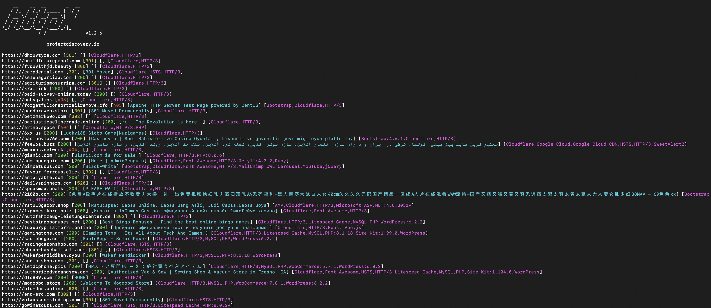
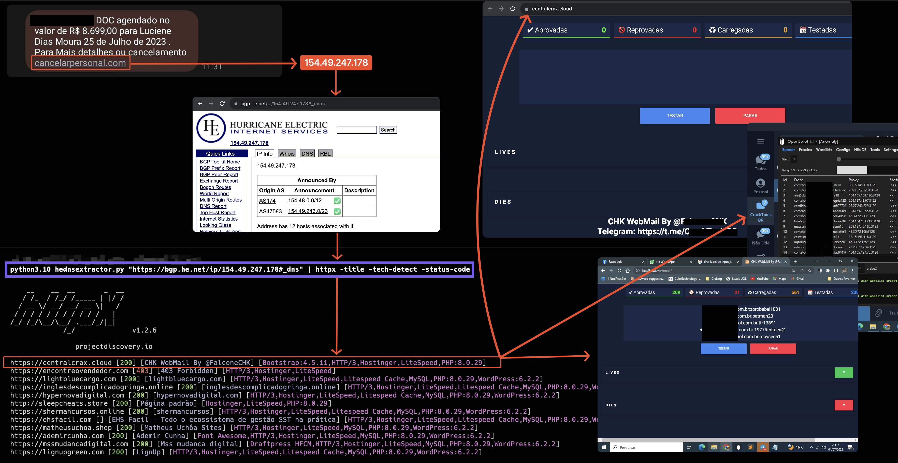

  

<h1 align="center">HEDnsExtractor</h1>

  
    

  Raw html extractor from Hurricane Electric portal

#JSON Format output

python3.10 HEDnsExtractor.py "https://bgp.he.net/net/81.82.0.0/15#_dns" --output-format json

# example usage:
1. Extract all domains and use httpx to search for specific value
   
python HEDnsExtractor.py "https://bgp.he.net/net/104.21.0.0/19#_dns" | httpx -title -tech-detect -status-code | grep -i "your search"

  

# 2. Phishing Hunting
   

  

